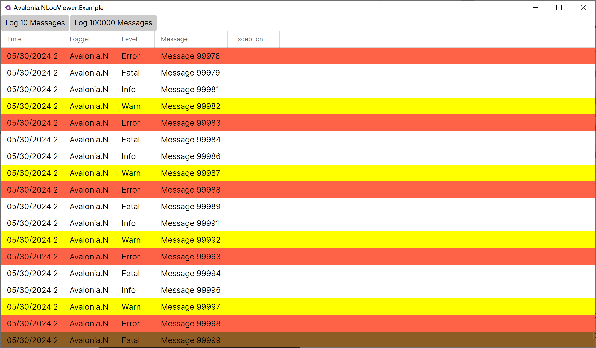

## Avalonia.NLogViewer

Inspired by https://github.com/erizet/NlogViewer, a viewer for WPF. I modified it to use it on Avalonia.

An improvement is that now it can display more than 100K messages per second.

Below is a demonstration:
